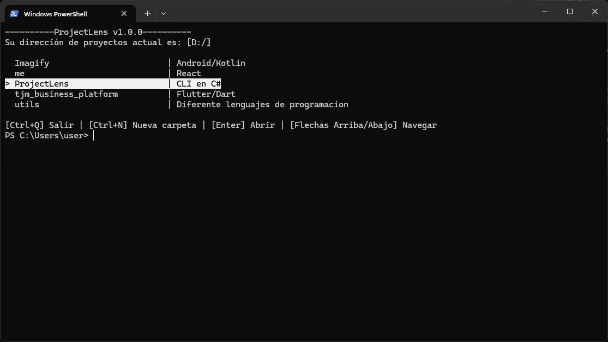
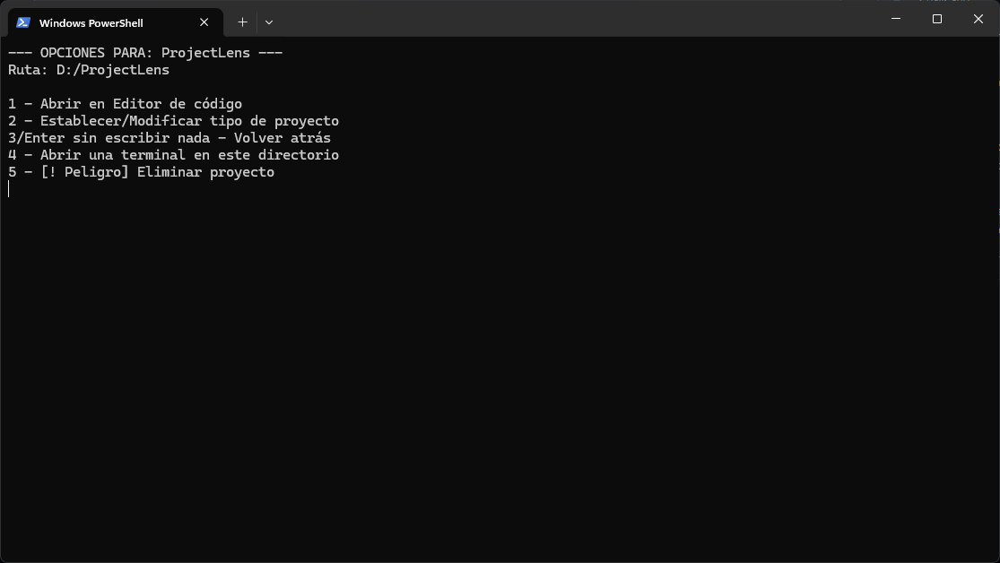
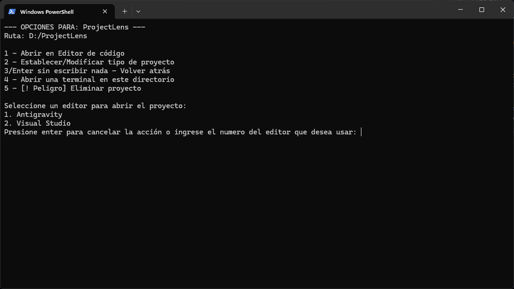

# 🔍 ProjectLens v1.0

**ProjectLens** es una herramienta de interfaz de línea de comandos (CLI) diseñada para gestionar y navegar rápidamente entre tus proyectos de desarrollo. Permite listar y abrir tus directorios de trabajo en tus editores de código favoritos o en la terminal.

## 📸 Capturas de Pantalla

| Vista Principal | Selección de un proyecto | Abrir en un editor de código |
| :---: | :---: | :---: |
|  |  |  |

---

## 🚀 Características Principales

* **Navegación Interactiva**: Muévete entre tus proyectos usando las flechas del teclado.
* **Detección de Tipos**: Identifica automáticamente el lenguaje o framework de cada carpeta mediante un archivo `project-type.txt`.
* **Multi-Editor**: Detecta dinámicamente qué editores tienes instalados (VS Code, Visual Studio 2026, Sublime Text, Antigravity, etc.).
* **Salto a Terminal**: Abre una nueva instancia de terminal directamente en la ruta del proyecto seleccionado.
* **Exclusión Inteligente**: Ignora automáticamente carpetas del sistema (System Volume Information) mediante Regex.

---

## 🛠️ Instalación y Configuración

### 1. Requisitos
* Tener instalado el **.NET Runtime 9.0** (o superior).

### 2. Añadir al PATH (Windows)
Para usar `ProjectLens` desde cualquier terminal:
1.  Copia el ejecutable `ProjectLens.exe` en una carpeta permanente (ej: `C:\Program Files\ProjectLens`).
2.  Presiona la tecla `Win`, busca **"Variables de entorno"** y abre el panel.
3.  En "Variables del sistema", busca la variable `Path` y selecciona **Editar**.
4.  Haz clic en **Nuevo** y pega la ruta de la carpeta (ej: `C:\Program Files\ProjectLens`).
5.  Reinicia tu terminal.

Incluso puedes renombrar el ejecutable al nombre que prefieras (ej: `projects.exe`) para mayor comodidad.

### 3. Configuración Inicial
La primera vez que ejecutes la app, te solicitará la ruta base de tus proyectos. Esta configuración se guarda en tu carpeta de usuario para persistencia.

---

## 📂 Estructura de Proyectos

Para que ProjectLens muestre el tipo de proyecto (ej: Python, React, C#), simplemente crea un archivo de texto dentro de la carpeta de tu proyecto:

* **Nombre del archivo:** `project-type.txt`
* **Contenido:** El nombre del lenguaje o tipo (ej: `Node.js`).

Si el archivo no existe, la app mostrará `type undefined`.

---

## ⌨️ Atajos de Teclado

| Tecla | Acción |
| :--- | :--- |
| `↑ / ↓` | Navegar por la lista de proyectos. |
| `Enter` | Abrir menú de opciones del proyecto seleccionado. |
| `Ctrl + Q` | Salir de la aplicación. |
| `1` | Abrir en el editor de código seleccionado. |
| `2` | Cambiar/Asignar tipo de proyecto manualmente. |
| `4` | Abrir terminal en el directorio del proyecto y cerrar app. |

---

## 🛠️ Desarrollo (Build)

Si deseas compilar el proyecto tú mismo, usa el script `build.bat` incluido en la raíz:
```bash
# Genera versiones x64 y x86 en la carpeta /bin/Release/Netx.x/
build.bat
```
